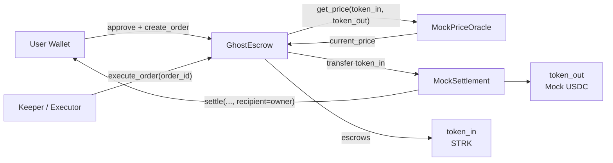

# GhostOrder

Private conditional orders on Starknet.

GhostOrder is a Cairo 2 smart contract protocol that allows users to create conditional token swap orders. A user deposits input tokens into the `GhostEscrow` contract and specifies a target price. The order stays inactive until the configured price oracle confirms the condition is met. At that point, a keeper can trigger execution — the contract transfers the escrowed tokens to the settlement contract and delivers the output tokens to the order owner.

---

## The Problem

Conditional trading typically requires either continuous manual monitoring or reliance on a centralized exchange. Bringing conditional execution on-chain introduces several requirements that need to be handled at the contract level:

- Input assets must be safely escrowed and not accessible until the condition is met or the order is cancelled.
- Orders must only become executable when the oracle-reported price satisfies the configured condition.
- Settlement must be atomic and token accounting must be verifiable on-chain.
- Once an order is executed or cancelled, it must not be processable again.

---

## How It Works

**Creating an order:**

1. The user approves `GhostEscrow` to spend their input token (`token_in`).
2. The user calls `create_order`, specifying:
   - `token_in` — the token to escrow
   - `token_out` — the token to receive
   - `amount_in` — amount to lock
   - `target_price` — minimum price (18-decimal u256) that must be satisfied
   - `min_amount_out` — minimum acceptable output (slippage floor)
   - `expiry` — Unix timestamp after which the order is expired
3. `GhostEscrow` transfers `amount_in` from the caller into itself and stores the order with status `Active`.

**Executing an order:**

4. Anyone can call `is_order_executable(order_id)` to check whether the oracle price currently satisfies the condition.
5. `GhostEscrow` queries `MockPriceOracle.get_price(token_in, token_out)` and checks `current_price >= target_price`.
6. A keeper calls `execute_order(order_id)`.
7. `GhostEscrow` asserts the order is `Active`, not expired, and the price condition is satisfied.
8. The escrowed `token_in` is transferred from `GhostEscrow` to `MockSettlement`.
9. `MockSettlement.settle(...)` transfers `token_out` directly to the order's owner address.
10. The order status is set to `Executed`. It cannot be executed or cancelled again.

**Cancelling an order:**

- Only the order owner can call `cancel_order(order_id)`.
- The contract asserts the order is `Active`, then sets status to `Cancelled` before transferring the escrowed tokens back to the owner (checks-effects-interactions pattern).
- Cancelled orders cannot be processed again.

---

## Architecture



---

## Contracts

All contracts are compiled with Cairo 2.20.0 and deployed on Starknet Sepolia.

| Contract | Address | Role |
|---|---|---|
| `GhostEscrow` | `0x05ac12e8a803d62ce65883a6352d1a38e7718b513721da2a5a0aeb2b79c6d53f` | Escrow, condition check, execution coordination |
| `MockPriceOracle` | `0x063cc916c44b0ca8e6394adbead8a30aa3c1c3de6355f1d060e2962eed5883f2` | On-chain price feed, readable by `get_price(token_in, token_out)` |
| `MockSettlement` | `0x06a24514c06e79b6879321b2d178f5d58848dc31e5c9aac5a0c51fd6bb6bf87e` | Receives input token and sends configured output token to recipient |
| `MockERC20` (USDC) | `0x072761a60da419b3f60b6e72900478f9bade6e01a0cfbdc8c49a69253fb8936f` | Test ERC-20 used as output token in integration tests |

Explorer: [sepolia.starkscan.co](https://sepolia.starkscan.co)

---

## Contract Interface

**`GhostEscrow`**

```cairo
fn create_order(
    token_in: ContractAddress,
    token_out: ContractAddress,
    amount_in: u256,
    target_price: u256,
    min_amount_out: u256,
    expiry: u64,
) -> u64

fn cancel_order(order_id: u64)

fn execute_order(order_id: u64)

fn get_order(order_id: u64) -> Order

fn get_order_count() -> u64

fn is_order_executable(order_id: u64) -> bool

fn get_oracle() -> ContractAddress

fn get_settlement() -> ContractAddress
```

**`Order` struct**

```cairo
struct Order {
    order_id: u64,
    owner: ContractAddress,
    token_in: ContractAddress,
    token_out: ContractAddress,
    amount_in: u256,
    target_price: u256,     // 18-decimal u256, must be >= oracle price to execute
    min_amount_out: u256,
    expiry: u64,            // Unix timestamp
    status: OrderStatus,    // Active | Executed | Cancelled
}
```

**`MockPriceOracle`**

```cairo
fn set_price(token_in: ContractAddress, token_out: ContractAddress, price: u256)
fn get_price(token_in: ContractAddress, token_out: ContractAddress) -> u256
```

**`MockSettlement`**

```cairo
fn settle(
    token_in: ContractAddress,
    token_out: ContractAddress,
    amount_in: u256,
    min_amount_out: u256,
    recipient: ContractAddress,
) -> u256

fn set_output_amount(token_in, token_out, amount_in, output_amount)
fn get_output_amount(token_in, token_out, amount_in) -> u256
```

---

## Events

| Event | Emitted by | Fields |
|---|---|---|
| `OrderCreated` | `GhostEscrow` | `order_id`, `owner`, `token_in`, `token_out`, `amount_in`, `target_price`, `min_amount_out`, `expiry` |
| `OrderCancelled` | `GhostEscrow` | `order_id`, `owner` |
| `OrderExecuted` | `GhostEscrow` | `order_id`, `keeper`, `amount_out` |
| `PriceSet` | `MockPriceOracle` | `token_in`, `token_out`, `price` |
| `SettlementExecuted` | `MockSettlement` | `token_in`, `token_out`, `amount_in`, `output_amount`, `recipient` |

---

## Repository Structure

```
.
├── src/
│   ├── lib.cairo               # Module declarations
│   ├── types.cairo             # Order struct, OrderStatus enum, all contract interfaces
│   ├── ghost_escrow.cairo      # Core escrow, condition check, and execution logic
│   ├── mock_price_oracle.cairo # Configurable price feed
│   ├── mock_settlement.cairo   # Token swap settlement
│   ├── mock_erc20.cairo        # Minimal ERC-20 for testing
│   └── tests.cairo             # Full on-chain integration tests
├── frontend/                   # React + Vite frontend (starknet.js v10)
│   └── src/
│       ├── config/             # Contract addresses, ABIs, token list
│       ├── context/            # WalletContext, OrderContext (live on-chain polling)
│       └── components/         # UI: Header, Hero, Dashboard, OrderList, Modals
├── scripts/
│   ├── test-onchain.ts         # Live Sepolia integration test: create, cancel
│   └── test-execution.ts       # Live Sepolia integration test: full execution lifecycle
├── strk20/
│   └── deploy.ts               # Deployment script (starknet.js + sncast)
├── Scarb.toml                  # Cairo 2.20.0 project config
└── package.json                # Node.js deps (starknet.js v10, Vite, React 19)
```

---

## Getting Started

### Prerequisites

- [Scarb](https://docs.swmansion.com/scarb/) 2.20.0
- [sncast](https://foundry-rs.github.io/starknet-foundry/) 0.63.0
- Node.js 20+
- A Starknet Sepolia account with STRK for gas

### Build contracts

```bash
scarb build
```

### Run Cairo tests

```bash
scarb test
```

### Configure environment

```bash
cp .env.example .env
```

Edit `.env` and set:

```env
ACCOUNT_ADDRESS=0x...
PRIVATE_KEY=0x...
STARKNET_RPC_URL=https://starknet-sepolia.g.alchemy.com/starknet/version/rpc/v0_8/demo
CHAIN_ID=SN_SEPOLIA
GHOST_ESCROW_ADDRESS=0x05ac12e8a803d62ce65883a6352d1a38e7718b513721da2a5a0aeb2b79c6d53f
ORACLE_ADDRESS=0x063cc916c44b0ca8e6394adbead8a30aa3c1c3de6355f1d060e2962eed5883f2
SETTLEMENT_ADDRESS=0x06a24514c06e79b6879321b2d178f5d58848dc31e5c9aac5a0c51fd6bb6bf87e
```

### Deploy contracts

```bash
npm run deploy
```

### Run on-chain integration tests

```bash
npm run test:onchain      # Create order → verify state → cancel → verify refund
npm run test:execution    # Create order → set price → execute → verify token accounting
```

### Run the frontend

```bash
npm install
npm run dev
```

The frontend connects to Starknet Sepolia, reads live on-chain order state using `starknet.js` v10, and supports wallet connection via Ready X, ArgentX, and Braavos.

---

## Verified On-Chain Tests (Sepolia)

The following transactions were executed live on Starknet Sepolia as part of integration testing:

| Test | Transaction |
|---|---|
| `cancel_order(1)` | [`0x73ec7df5521f5e0416c5dd58582f7fd42ba755f24369505322b3f97e064ebab`](https://sepolia.starkscan.co/tx/0x73ec7df5521f5e0416c5dd58582f7fd42ba755f24369505322b3f97e064ebab) |
| `execute_order(2)` | [`0x3ef151d5f7d893eddd2a3fe5ddadb2fc9235b0e9047104abef7560e729c2854`](https://sepolia.starkscan.co/tx/0x3ef151d5f7d893eddd2a3fe5ddadb2fc9235b0e9047104abef7560e729c2854) |

**Order #1:** 0.01 STRK escrowed → cancelled → 0.01 STRK refunded to owner.

**Order #2:** 0.01 STRK escrowed → oracle price set to 2.50 (target ≥ 2.00) → executed → 0.025 Mock USDC delivered to owner.

Post-execution: double-execution and cancellation both reverted with `'Order is not active'`.

---

## Tech Stack

| Layer | Technology |
|---|---|
| Smart contracts | Cairo 2.20.0, Scarb 2.20.0, sncast 0.63.0 |
| Starknet network | Starknet Sepolia |
| Frontend | React 19, Vite 8, TypeScript |
| Starknet SDK | starknet.js v10 |
| RPC | Alchemy Starknet Sepolia |
| Explorer | Starkscan |

---

## Notes

- `MockPriceOracle` stores prices as plain `u256` values — there is no oracle aggregation, TWAP, or external price feed. Prices are set manually via `set_price`.
- `MockSettlement` uses a pre-configured output amount table. If no output is configured for a given `(token_in, token_out, amount_in)` triplet, it falls back to `min_amount_out`.
- The `expiry` field is checked at execution time using `get_block_timestamp()`. Expired orders cannot be executed.
- Order IDs are sequential starting from 1. ID 0 is invalid.
- The checks-effects-interactions pattern is applied to `cancel_order`: status is set to `Cancelled` before the refund transfer.

---

## License

MIT
