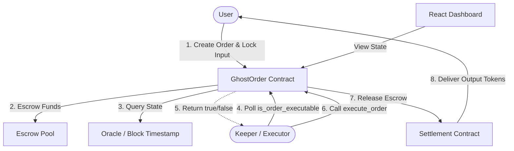
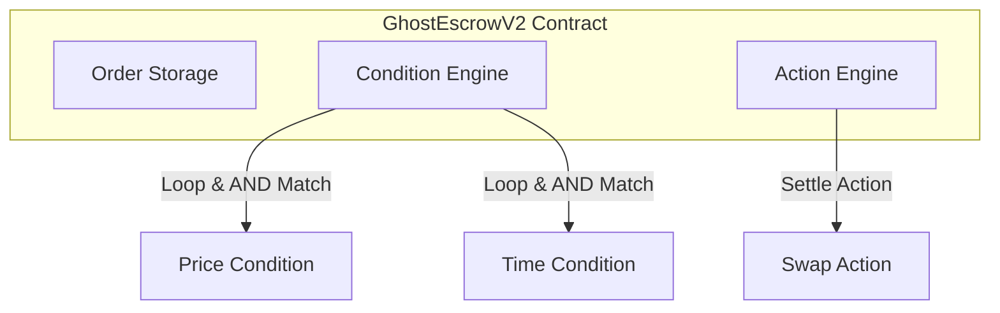

# GhostOrder

Programmable conditional execution for Starknet.

GhostOrder is an on-chain automation protocol that enables users to schedule conditional transaction execution flows. By moving user intentions directly into secure smart-contract escrows, the protocol allows developers to build trigger-based automation workflows without introducing centralization vectors.

---

## 💡 What is GhostOrder?

GhostOrder enables the creation of conditional on-chain orders that remain completely dormant in contract storage until predefined state conditions are satisfied. 

The protocol operates on a simple, trustless automation model:

```
USER INTENT
     ↓
 CONDITION
     ↓
   WAIT
     ↓
CONDITION SATISFIED
     ↓
  EXECUTE
```

Users specify exactly *what* needs to be executed and *under what conditions*. Once those conditions are verified on-chain, public keepers trigger the action permissionlessly.

---

## ⚠️ The Problem

In Web3, taking an action on-chain usually requires active monitoring and manual execution.

Consider a simple user intention:
> *"I want to swap my STRK for USDC when STRK reaches $2.00, but I don't want to sit in front of a chart and manually execute the transaction."*

Traditional workflows present major friction points:
- **Active Monitoring:** Users must constantly watch price feeds, block heights, or time conditions.
- **Delayed Execution:** Missing a market trigger can lead to sub-optimal execution prices.
- **Infrastructure Dependencies:** Relying on centralized triggering scripts introduces single points of failure and trust trade-offs.
- **Complex Intents:** Combining multiple criteria (e.g. price threshold *and* time delay) is impossible to configure natively on typical decentralized exchanges.

---

## 💡 The Solution

GhostOrder provides a programmable execution layer that automates these intents natively on Starknet.

The protocol structures automated actions into a clean template:

- **WHEN:** A specific state trigger occurs (e.g. STRK price hits a target).
- **AND:** Optional additional criteria are met (e.g. a specific timestamp has passed).
- **THEN:** Execute the configured transaction action (e.g. swap assets).

During order creation, the user transfers the required inputs directly to a secure escrow contract. The smart contract maintains ownership of the funds and exposes view functions that verify whether conditions are satisfied. When satisfied, permissionless keepers trigger execution, and the contract routes the assets to the settlement interface.

---

## 🏗️ System Architecture

### Protocol Flow
The diagram below illustrates the end-to-end lifecycle and data flows of the GhostOrder protocol:



### V2 Internal Engine
GhostOrder V2 extends the core escrow contract into a modular, programmable execution engine:



---

## 📋 How It Works

The lifecycle of an automated order progresses through five distinct stages:

### 01 — Create Order
The user configures the target order parameters on-chain, including input assets, target conditions, desired action parameters, and order expiry.

### 02 — Funds Enter Escrow
The input tokens are transferred from the user's account and locked securely inside the GhostOrder escrow pool.

### 03 — Wait
The order remains dormant in contract storage. The user can safely close their wallet and browser tab; the contract maintains the escrowed assets.

### 04 — Condition Satisfied
An oracle update or the passage of block time satisfies the target conditions configured in the contract.

### 05 — Execute
A permissionless keeper detects the executable state, calls `execute_order()`, and the contract atomically completes the transaction, delivering the outputs to the user.

---

## 📄 Smart Contracts

The repository is organized into distinct, modular smart contracts:

- **[`ghost_escrow_v2.cairo`](file:///Users/mikasa05/Documents/Ghost/src/ghost_escrow_v2.cairo):** The core protocol contract. Manages escrowed funds, runs the V2 Condition Engine, and coordinates execution triggers.
- **[`types.cairo`](file:///Users/mikasa05/Documents/Ghost/src/types.cairo):** Defines serialization schemas, interfaces, custom `Condition` and `Action` structs, and the protocol's status enums.
- **`mock_price_oracle.cairo`:** A mock price feed contract used for simulating live asset price feeds.
- **`mock_settlement.cairo`:** Simulates dex/amm token routing by taking input assets from the escrow contract and delivering output tokens to the user.
- **`mock_erc20.cairo`:** Standard ERC-20 token interface used for STRK and USDC mock token instances.

---

## 🤖 Permissionless Keeper Execution

Execution of satisfied intents is completely permissionless. A network of keeper daemons polls the contract to automate transactions:

1. **Scan:** The keeper queries the contract for all active order IDs.
2. **Check:** The keeper calls the view function `is_order_executable(order_id)`.
3. **Trigger:** If `true`, the keeper submits the `execute_order(order_id)` transaction.

> [!IMPORTANT]
> The keeper **does not** decide whether an order is valid or satisfied. The smart contract evaluates the conditions on-chain during the execution transaction and will revert if the keeper attempts to execute an order prematurely.

---

## 🛡️ Security Model

- **On-Chain Logic Verification:** The contract evaluates oracle prices and timestamps directly in the Cairo VM, making it impossible to trigger execution unless conditions are satisfied.
- **Immutable Call Parameters:** The keeper only passes the `order_id` as calldata. The tokens, swap amounts, and destination addresses are retrieved directly from contract storage, preventing keepers from altering transaction destinations.
- **Re-entrancy Protection:** Order status is updated to `Executed` before assets leave the contract custody.
- **Strict Expiry Limits:** The execution function reverts if `block_timestamp >= expiry`, preventing old orders from executing during unexpected market conditions.
- **Owner-Exclusive Cancellations:** Active orders can only be cancelled by the order's creator (`owner`), which refunds the escrowed assets immediately.

---

## 🔄 V2: From Conditional Orders to Programmable Execution

V1 served as the original proof-of-concept, supporting simple, price-triggered limit orders. V2 generalizes the protocol into a programmable conditional execution engine.

```
V1 PROTOCOL
 Price Condition  ──>  Fixed Swap Execution Flow

V2 PROTOCOL
 Conditions Array ──>  Condition Engine  ──>  Action Engine (Modular Actions)
```

V2 introduces:
- **Condition Structs:** Generic data structure storing parameters for multiple condition types.
- **Time Conditions:** Execution locks that evaluate block timestamps.
- **Comparison Operators:** Flexibility to use `<, <=, >, >=, ==` comparisons for oracle values.
- **AND Operator Logic:** Evaluating lists of multiple conditions together.
- **Action Abstraction:** Decoupling asset deposits and triggers from the execution routing.

### V1 vs V2 Comparison

| Feature | V1 | V2 |
| :--- | :--- | :--- |
| **Execution model** | Conditional trading | Programmable execution |
| **Conditions** | Predefined price logic | Structured conditions |
| **Time condition** | No | Yes |
| **Multiple conditions** | Limited (Price only) | Multiple conditions using AND |
| **Action model** | Fixed token swap flow | Action abstraction |
| **Keeper** | Permissionless | Permissionless |

### V2 Architecture Primitive

V2 structures intents into an expandable condition-action matrix:

```
WHEN  [Condition A (Price >= target)]
AND   [Condition B (Time >= timestamp)]
THEN  [Action (Swap STRK -> USDC)]
```

---

## 📍 Starknet Sepolia Deployments

The protocol is actively deployed and verified on **Starknet Sepolia**:

| Contract Name | Contract Address | Class Hash |
| :--- | :--- | :--- |
| **GhostEscrowV2** | `0x6a6cc27975f4020f8151ae8d6c9f8e233b879d167768f53e48a2a6be4610aa7` | `0x68746de6148b1911f18f4d6c76a73b857c5dead403efd6bdf8b10f883aef29f` |
| **MockPriceOracle** | `0x63cc916c44b0ca8e6394adbead8a30aa3c1c3de6355f1d060e2962eed5883f2` | `0x00f72365bf8ff3cc5cc919b48c105bfad2e08da2ce279148d428bf0e606060c` |
| **MockSettlement** | `0x6a24514c06e79b6879321b2d178f5d58848dc31e5c9aac5a0c51fd6bb6bf87e` | `0x040523a5bfd89ab5ffcc268df10ac35bbcd238d21b790d56b4618da2c8b0e8c8` |

### On-Chain Verification

An end-to-end V2 execution test was run live on Sepolia, verifying the full lifecycle of a multi-condition order:

- **Declaration Transaction:** [0x71c696ca04db71b07796ff41cf9b2a2e6116a50c195675a9daf16a895ef836a](https://sepolia.starkscan.co/tx/0x71c696ca04db71b07796ff41cf9b2a2e6116a50c195675a9daf16a895ef836a)
- **Deployment Transaction:** [0x3be0c9c265b9e57a06bbb4d1be83ec78f5aa600849489da8cf30b734673aabe](https://sepolia.starkscan.co/tx/0x3be0c9c265b9e57a06bbb4d1be83ec78f5aa600849489da8cf30b734673aabe)
- **Create Order Transaction:** [0x71b1c7ca82957a8d26282ceb406340210a72ec8287994258b00fe2a76dd9c1f](https://sepolia.starkscan.co/tx/0x71b1c7ca82957a8d26282ceb406340210a72ec8287994258b00fe2a76dd9c1f)
- **Oracle Price Update Transaction:** [0x45694cdcbc8673a05418a7e577571e8878f1d0a1aa1167427e2419954b103b4](https://sepolia.starkscan.co/tx/0x45694cdcbc8673a05418a7e577571e8878f1d0a1aa1167427e2419954b103b4)
- **Keeper Execution Transaction:** [0xb5116c5cdb56f530d23874815a6c6351519c187c53098bf4148ea7a7ea5815](https://sepolia.starkscan.co/tx/0xb5116c5cdb56f530d23874815a6c6351519c187c53098bf4148ea7a7ea5815)

---

## 🧪 Testing

The repository supports both local unit testing and live Starknet Sepolia integration testing:

### Local Cairo Unit Tests
To compile the smart contracts and execute the complete test suite (both V1 and V2 logic tests):
```bash
scarb build
scarb test
```

### V2 On-Chain Integration Test
To run the automated, end-to-end integration test validating condition logic and keeper execution live on Starknet Sepolia:
```bash
npm run test:v2-onchain
```

---

## 📂 Project Structure

- **[`src/ghost_escrow_v2.cairo`](file:///Users/mikasa05/Documents/Ghost/src/ghost_escrow_v2.cairo)**: V2 escrow contract, condition engine, and action engine.
- **[`src/types.cairo`](file:///Users/mikasa05/Documents/Ghost/src/types.cairo)**: Interface declarations, V2 structs, and serializations.
- **[`scripts/executor.ts`](file:///Users/mikasa05/Documents/Ghost/scripts/executor.ts)**: Polling keeper script checking order execution status on-chain.
- **[`scripts/test-v2-onchain.ts`](file:///Users/mikasa05/Documents/Ghost/scripts/test-v2-onchain.ts)**: Integration script testing V2 orders dynamically.
- **[`scripts/deploy-v2.ts`](file:///Users/mikasa05/Documents/Ghost/scripts/deploy-v2.ts)**: Deployment script declaring and instantiating V2 contracts.
- **[`frontend/src`](file:///Users/mikasa05/Documents/Ghost/frontend/src)**: React wallet integration and order scheduling panel.

---

## 🚀 Quick Start

Follow these steps to set up the repository, build contracts, run tests, and spin up the frontend and keeper:

```bash
# 1. Install workspace dependencies
npm install

# 2. Compile smart contracts
scarb build

# 3. Run unit tests
scarb test

# 4. Run the frontend dashboard
cd frontend
npm install
npm run dev

# 5. Run the permissionless keeper script (in root)
npx ts-node scripts/executor.ts

# 6. Run the live V2 integration test on Sepolia
npm run test:v2-onchain
```

---

## ✅ Current V2 Status

| Feature | Status |
| :--- | :--- |
| **GhostEscrowV2** | ✅ |
| **Price Condition** | ✅ |
| **Time Condition** | ✅ |
| **AND Conditions** | ✅ |
| **OR Conditions** | ❌ |
| **Swap Action** | ✅ |
| **Permissionless Keeper** | ✅ |
| **Cancellation** | ✅ |
| **Expiry** | ✅ |
| **Double Execution Protection** | ✅ |
| **Starknet Sepolia Deployment** | ✅ |
| **On-chain Integration Test** | ✅ |

---

## 🚧 Current Limitations

- **No Logical OR Support:** The Condition Engine only evaluates lists of conditions using logical `AND`. Compound expressions requiring logical `OR` are currently not supported.
- **Single Swap Action:** The Action Engine is structured dynamically but currently only defines the `Swap` variant. Other actions like `Transfer` or `Lend` are not yet implemented.
- **Shared Escrow Custody:** Funds must be deposited directly into the shared `GhostEscrowV2` contract escrow custody, requiring trust in the contract's locking logic.
- **Simulation Settlement:** The swap action is currently cleared through the simulated settlement interface (`MockSettlement`) rather than a live AMM aggregator.

---

## 🗺️ Future Roadmap

- **AND/OR Expression Trees:** Support nested conditional logic trees in the Cairo core.
- **Sub-Account Custody:** Implement session-key based execution intents, keeping assets in user smart-contract accounts rather than contract escrow.
- **Generic Action Variants:** Add `Transfer` (recurring payments) and `Lend` (liquidity providing) actions.
- **DEX Integrations:** Integrate AVNU and Ekubo routing for real AMM settlements on Starknet Mainnet.

---

## 📄 License

GhostOrder is open source software licensed under the MIT License.

See the [LICENSE](LICENSE) file for the full license text.

## Project Status

GhostOrder V2 is complete and ready for demo recording.
