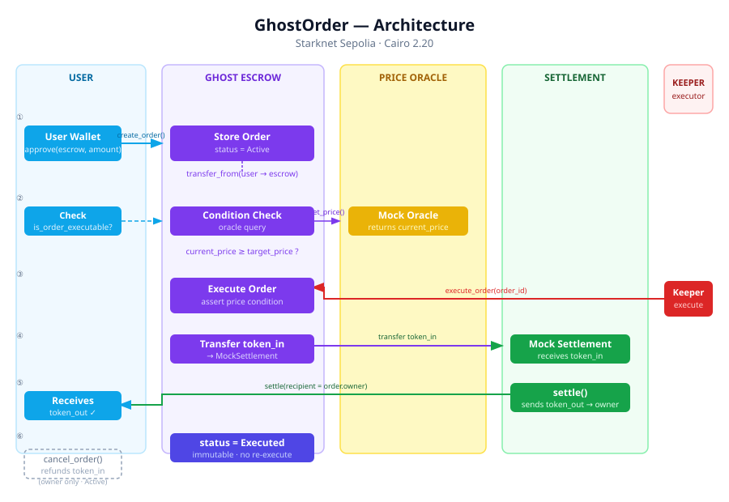
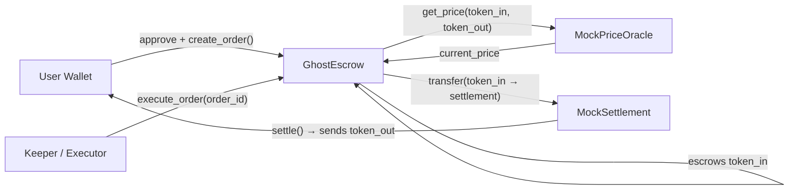
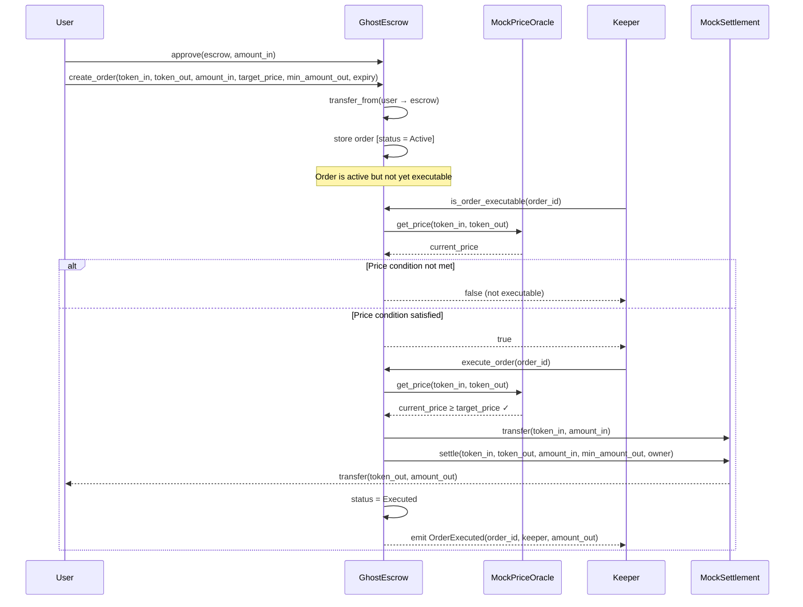

# GhostOrder

**Private conditional orders on Starknet.**

GhostOrder is a Cairo 2 smart contract protocol for creating conditional token swap orders on Starknet. A user deposits input tokens into `GhostEscrow` and configures a price condition. The order remains dormant until the price oracle confirms the condition is satisfied, at which point a keeper can trigger atomic settlement — input tokens go to the settlement contract, and output tokens are delivered directly to the order owner. Once executed or cancelled, an order cannot be touched again.

---

## Table of Contents

- [The Problem](#the-problem)
- [How It Works](#how-it-works)
- [Architecture](#architecture)
- [Order Execution Flow](#order-execution-flow)
- [Order Lifecycle & Safety](#order-lifecycle--safety)
- [Smart Contracts](#smart-contracts)
- [Contract Interface](#contract-interface)
- [Starknet Sepolia Deployment](#starknet-sepolia-deployment)
- [On-Chain Verification](#on-chain-verification)
- [Security Properties](#security-properties)
- [Project Structure](#project-structure)
- [Running Locally](#running-locally)
- [Tech Stack](#tech-stack)
- [Disclaimer](#disclaimer)

---

## The Problem

Conditional trading typically requires continuously monitoring prices or relying on a centralized exchange. Bringing conditional execution fully on-chain introduces several challenges that must be enforced at the contract level:

- Input assets must be safely escrowed and inaccessible to anyone until the condition is met or the order is cancelled by its owner.
- An order should only become executable once an on-chain oracle confirms the price condition is satisfied.
- Settlement must be atomic — if settlement fails, the whole transaction reverts.
- Executed or cancelled orders must be permanently immutable.

GhostOrder enforces all of these invariants in Cairo using a single `GhostEscrow` contract coordinating a `MockPriceOracle` and a `MockSettlement`.

---

## How It Works

### Creating an order

1. The user connects their Starknet wallet.
2. The user approves `GhostEscrow` to spend `amount_in` of `token_in`.
3. The user calls `create_order(token_in, token_out, amount_in, target_price, min_amount_out, expiry)`.
4. `GhostEscrow` executes `transfer_from(user → escrow)` to hold the input tokens.
5. The order is stored on-chain with status `Active`.

### Executing an order

6. Anyone can call `is_order_executable(order_id)` at any time to check whether the condition is currently satisfied.
7. `GhostEscrow` calls `MockPriceOracle.get_price(token_in, token_out)` and checks `current_price >= target_price`.
8. If the condition is met, a keeper calls `execute_order(order_id)`.
9. `GhostEscrow` asserts the order is `Active`, not expired, and the price condition holds.
10. The escrowed `token_in` is transferred from `GhostEscrow` to `MockSettlement`.
11. `MockSettlement.settle(token_in, token_out, amount_in, min_amount_out, recipient)` delivers `token_out` directly to the order owner.
12. `GhostEscrow` marks the order `Executed`. It cannot be re-executed or cancelled.

### Cancelling an order

- Only the order owner can call `cancel_order(order_id)`.
- The contract asserts the order is `Active`, sets status to `Cancelled` **before** the refund transfer (checks-effects-interactions), then transfers the exact escrowed amount back to the owner.

---

## Architecture





**Token flow on execution:**

```
User Wallet
  │
  │ (1) approve + create_order()
  ▼
GhostEscrow  ──────── holds token_in ────────────────────┐
  │                                                       │
  │ (2) get_price(token_in, token_out)                   │
  ▼                                                       │
MockPriceOracle                                           │
  │ current_price                                         │
  ▼                                                       │
GhostEscrow (condition check: current_price ≥ target)    │
  │                                                       │
  │ (3) transfer token_in ◄───────────────────────────────┘
  ▼
MockSettlement
  │
  │ (4) settle(recipient = order.owner)
  ▼
User Wallet  ←── receives token_out
```

---

## Order Execution Flow



---

## Order Lifecycle & Safety

```
              ┌──────────┐
              │  ACTIVE  │
              └────┬─────┘
                   │
        ┌──────────┴──────────┐
        │                     │
        ▼                     ▼
  ┌──────────┐           ┌───────────┐
  │ EXECUTED │           │ CANCELLED │
  └──────────┘           └───────────┘
```

Enforced invariants (verified in `ghost_escrow.cairo`):

| Invariant | How it is enforced |
|---|---|
| Only `Active` orders can be executed | `assert(order.status == OrderStatus::Active, 'Order is not active')` |
| Only `Active` orders can be cancelled | Same assertion in `cancel_order` |
| Orders must not be expired | `assert(current_time < order.expiry, 'Order has expired')` |
| Price condition must be satisfied | `assert(current_price >= order.target_price, 'Price condition not met')` |
| Settlement output must meet minimum | `assert(actual_amount_out >= order.min_amount_out, 'Output below min_amount_out')` |
| Cancellation refund is reentrancy-safe | Status is set to `Cancelled` before the refund transfer |
| `Executed` orders cannot be re-executed | Status check fails at step 1 |
| `Executed` orders cannot be cancelled | Status check fails in `cancel_order` |
| `Cancelled` orders cannot be executed | Status check fails in `execute_order` |

---

## Smart Contracts

### GhostEscrow

The core contract. It:

- Accepts conditional order creation from any Starknet address.
- Holds escrowed `token_in` for each `Active` order.
- Stores order state in a `Map<u64, Order>` keyed by sequential order ID.
- Checks whether an order is executable by reading the oracle price.
- Coordinates execution by transferring `token_in` to `MockSettlement` and calling `settle()`.
- Allows the order owner to cancel an active order and receive a full refund.
- Prevents double-execution and post-execution cancellation via the `OrderStatus` enum.
- Emits `OrderCreated`, `OrderCancelled`, and `OrderExecuted` events.

### MockPriceOracle

A configurable price feed for testing. It:

- Stores a `u256` price per `(token_in, token_out)` pair.
- Exposes `set_price(token_in, token_out, price)` for anyone to update.
- Provides `get_price(token_in, token_out)` — the function `GhostEscrow` reads to evaluate the price condition.
- Emits `PriceSet` on every update.

> There is no aggregation, TWAP, or external data source. Prices are stored as raw `u256` values.

### MockSettlement

Handles token swap settlement. It:

- Receives `token_in` transferred directly from `GhostEscrow`.
- Looks up a pre-configured `output_amount` for the `(token_in, token_out, amount_in)` triplet. If none is configured, falls back to `min_amount_out`.
- Asserts `output_amount >= min_amount_out` before proceeding.
- Calls `transfer(recipient, output_amount)` on the `token_out` ERC-20, delivering the output directly to the order owner.
- Emits `SettlementExecuted` on success.

### MockERC20

A minimal ERC-20 used as the output token in integration tests. It supports standard `transfer`, `transfer_from`, `approve`, `balance_of`, and a `mint(recipient, amount)` function used to fund the settlement contract during testing.

---

## Contract Interface

**`GhostEscrow`**

```cairo
fn create_order(
    token_in: ContractAddress,
    token_out: ContractAddress,
    amount_in: u256,
    target_price: u256,    // 18-decimal u256
    min_amount_out: u256,
    expiry: u64,           // Unix timestamp
) -> u64                   // returns new order_id

fn cancel_order(order_id: u64)

fn execute_order(order_id: u64)

fn get_order(order_id: u64) -> Order

fn get_order_count() -> u64

fn is_order_executable(order_id: u64) -> bool

fn get_oracle() -> ContractAddress

fn get_settlement() -> ContractAddress
```

**`Order` struct**

```cairo
struct Order {
    order_id:       u64,
    owner:          ContractAddress,
    token_in:       ContractAddress,
    token_out:      ContractAddress,
    amount_in:      u256,
    target_price:   u256,         // execution gate: current_price >= target_price
    min_amount_out: u256,         // slippage floor for settlement
    expiry:         u64,          // block timestamp after which order cannot execute
    status:         OrderStatus,  // Active | Executed | Cancelled
}
```

**`MockPriceOracle`**

```cairo
fn set_price(token_in: ContractAddress, token_out: ContractAddress, price: u256)
fn get_price(token_in: ContractAddress, token_out: ContractAddress) -> u256
```

**`MockSettlement`**

```cairo
fn settle(
    token_in:       ContractAddress,
    token_out:      ContractAddress,
    amount_in:      u256,
    min_amount_out: u256,
    recipient:      ContractAddress,
) -> u256

fn set_output_amount(token_in, token_out, amount_in, output_amount)
fn get_output_amount(token_in, token_out, amount_in) -> u256
```

---

## Events

| Event | Contract | Key fields |
|---|---|---|
| `OrderCreated` | `GhostEscrow` | `order_id`, `owner`, `token_in`, `token_out`, `amount_in`, `target_price`, `min_amount_out`, `expiry` |
| `OrderCancelled` | `GhostEscrow` | `order_id`, `owner` |
| `OrderExecuted` | `GhostEscrow` | `order_id`, `keeper`, `amount_out` |
| `PriceSet` | `MockPriceOracle` | `token_in`, `token_out`, `price` |
| `SettlementExecuted` | `MockSettlement` | `token_in`, `token_out`, `amount_in`, `output_amount`, `recipient` |
| `OutputAmountConfigured` | `MockSettlement` | `token_in`, `token_out`, `amount_in`, `output_amount` |

---

## Starknet Sepolia Deployment

All contracts are deployed and verified on Starknet Sepolia.

| Contract | Address |
|---|---|
| `GhostEscrow` | [`0x05ac12e8a803d62ce65883a6352d1a38e7718b513721da2a5a0aeb2b79c6d53f`](https://sepolia.starkscan.co/contract/0x05ac12e8a803d62ce65883a6352d1a38e7718b513721da2a5a0aeb2b79c6d53f) |
| `MockPriceOracle` | [`0x063cc916c44b0ca8e6394adbead8a30aa3c1c3de6355f1d060e2962eed5883f2`](https://sepolia.starkscan.co/contract/0x063cc916c44b0ca8e6394adbead8a30aa3c1c3de6355f1d060e2962eed5883f2) |
| `MockSettlement` | [`0x06a24514c06e79b6879321b2d178f5d58848dc31e5c9aac5a0c51fd6bb6bf87e`](https://sepolia.starkscan.co/contract/0x06a24514c06e79b6879321b2d178f5d58848dc31e5c9aac5a0c51fd6bb6bf87e) |

**Class hashes (Sierra):**

| Contract | Class Hash |
|---|---|
| `GhostEscrow` | `0x01f01ca79d1f2184a047df7adc594f97610882cf9f7825dc25d1bcc96a61ecd3` |
| `MockPriceOracle` | `0x03326e03ae724c33c4902a653d94775996e4e2cd651078bf8c71476e2d5a919e` |
| `MockSettlement` | `0x06d5bc2a2456020a27f6b7592f3cf296bb39799c399a83cf4723845ec8983b66` |

---

## On-Chain Verification

### Cairo unit tests

```
scarb test
```

**32 tests passed, 0 failed.**

Tests cover: order creation, execution at/above/below target price, expired order rejection, cancelled order rejection, double-execution prevention, multi-order accounting, unauthorized cancellation, zero-amount rejections, same-token rejections, and past-expiry rejection.

### TypeScript type check

```bash
npm run typecheck
# 0 errors
```

### Integration test: create + cancel

```bash
npm run test:onchain
```

Verified on Starknet Sepolia:

- Oracle `set_price` →  confirmed
- Escrow `create_order` → STRK deposited, order ID returned
- `get_order` → status `Active`, fields correct
- `is_order_executable` → returned `false` (price not yet set)
- `cancel_order` → reverted escrow, status `Cancelled`
- Escrow refund → exact `amount_in` returned to owner

Transaction: [`0x73ec7df5521f5e0416c5dd58582f7fd42ba755f24369505322b3f97e064ebab`](https://sepolia.starkscan.co/tx/0x73ec7df5521f5e0416c5dd58582f7fd42ba755f24369505322b3f97e064ebab)

### Integration test: full execution lifecycle

```bash
npm run test:execution
```

Verified on Starknet Sepolia:

- Order created → 0.01 STRK escrowed
- `is_order_executable` → `false` (price condition not met)
- Oracle updated: price set to 2.50 (target was 2.00)
- `is_order_executable` → `true`
- `execute_order` called
- Settlement transferred 0.025 Mock USDC to order owner
- Escrow balance cleared (escrowed STRK moved to settlement)
- Order status → `Executed`
- Attempted re-execution → reverted with `'Order is not active'`
- Attempted cancellation after execution → reverted with `'Order is not active'`

Transaction: [`0x3ef151d5f7d893eddd2a3fe5ddadb2fc9235b0e9047104abef7560e729c2854`](https://sepolia.starkscan.co/tx/0x3ef151d5f7d893eddd2a3fe5ddadb2fc9235b0e9047104abef7560e729c2854)

---

## Security Properties

These properties are enforced by the Cairo contract and verified by the test suite. GhostOrder has **not** been formally audited.

| Property | Mechanism |
|---|---|
| Assets are held exclusively by `GhostEscrow` | `transfer_from` on create; no withdrawal path except execute or cancel |
| Only the order owner can cancel | `assert(order.owner == caller, 'Unauthorized: not owner')` |
| Any caller can execute an eligible order | No access restriction on `execute_order` — open keeper model |
| Cancellation refund cannot be reentrancy-exploited | Status updated to `Cancelled` before the refund `transfer` |
| Output below `min_amount_out` reverts the entire tx | Asserted both in `GhostEscrow` and `MockSettlement` |
| Expired orders are permanently unexecutable | `get_block_timestamp()` checked in both `execute_order` and `is_order_executable` |
| Order IDs are sequential and non-reusable | Incremented monotonically; `0` is explicitly invalid |

---

## Project Structure

```
GhostOrder/
├── src/                            # Cairo 2 smart contracts
│   ├── lib.cairo                   # Module declarations
│   ├── types.cairo                 # Order struct, OrderStatus, all interfaces
│   ├── ghost_escrow.cairo          # Core escrow + execution logic
│   ├── mock_price_oracle.cairo     # Configurable price feed
│   ├── mock_settlement.cairo       # Settlement + token delivery
│   ├── mock_erc20.cairo            # Minimal ERC-20 with mint()
│   └── tests.cairo                 # 32 Cairo unit tests
│
├── scripts/
│   ├── test-onchain.ts             # Live integration test: create + cancel
│   └── test-execution.ts          # Live integration test: full execution lifecycle
│
├── strk20/
│   ├── deploy.ts                   # Deployment script (declare + deploy all contracts)
│   ├── config.ts                   # RPC + chain config loader
│   ├── activate-account.ts         # Account activation helper
│   └── test-privacy-flow.ts        # STRK20 shielded pool test flow
│
├── frontend/                       # React 19 + Vite 8 frontend
│   └── src/
│       ├── App.tsx                 # Root layout
│       ├── index.css               # Global dark-theme CSS (CSS variables)
│       ├── components/             # Header, Hero, Dashboard, OrderList, Modals, Footer
│       ├── config/                 # Contract addresses, ABIs, token list
│       ├── context/                # WalletContext, OrderContext (live on-chain polling)
│       └── types/                  # TypeScript contract types
│
├── docs/
│   └── ghostorder-architecture.svg # Architecture diagram
│
├── Scarb.toml                      # Cairo 2.20.0 project config
├── package.json                    # Node.js deps (starknet.js v10, Vite, React 19)
├── tsconfig.json                   # TypeScript config
├── vite.config.ts                  # Vite config
├── .env.example                    # Environment variable template
└── README.md
```

---

## Running Locally

### Prerequisites

- [Scarb](https://docs.swmansion.com/scarb/) `2.20.0`
- Node.js `20+`
- A Starknet Sepolia account with STRK for gas (for running live scripts)

### Smart Contracts

```bash
# Build all Cairo contracts (Sierra + CASM output in target/dev/)
scarb build

# Run all 32 unit tests
scarb test
```

### Environment setup

```bash
cp .env.example .env
```

Edit `.env`:

```env
ACCOUNT_ADDRESS=0x...
PRIVATE_KEY=0x...
STARKNET_RPC_URL=https://starknet-sepolia.g.alchemy.com/starknet/version/rpc/v0_8/demo
CHAIN_ID=SN_SEPOLIA

# Deployed contract addresses (Sepolia)
GHOST_ESCROW_ADDRESS=0x05ac12e8a803d62ce65883a6352d1a38e7718b513721da2a5a0aeb2b79c6d53f
ORACLE_ADDRESS=0x063cc916c44b0ca8e6394adbead8a30aa3c1c3de6355f1d060e2962eed5883f2
SETTLEMENT_ADDRESS=0x06a24514c06e79b6879321b2d178f5d58848dc31e5c9aac5a0c51fd6bb6bf87e
```

### TypeScript scripts

```bash
npm install

# Type check all TypeScript
npm run typecheck

# Integration test: create order → cancel → verify refund
npm run test:onchain

# Integration test: create order → set oracle price → execute → verify settlement
npm run test:execution
```

### Deploy contracts

```bash
# Declare and deploy MockPriceOracle, MockSettlement, GhostEscrow
npm run deploy
```

### Frontend

```bash
npm run dev
# Opens at http://localhost:3000
```

The frontend connects to Starknet Sepolia via `starknet.js` v10, reads live on-chain order state (polling `get_order_count` and `get_order` per ID), and supports wallet connection via Ready X, ArgentX, and Braavos.

---

## Tech Stack

| Layer | Technology |
|---|---|
| Smart contracts | Cairo 2.20.0 |
| Build toolchain | Scarb 2.20.0 |
| Deployment | starknet.js v10, sncast |
| Network | Starknet Sepolia |
| RPC | Alchemy Starknet Sepolia |
| Explorer | [sepolia.starkscan.co](https://sepolia.starkscan.co) |
| Frontend | React 19, Vite 8, TypeScript |
| Wallet integration | get-starknet-core, starknet.js |

---

## Disclaimer

GhostOrder is a testnet project built and tested on Starknet Sepolia. The contracts and mock components are intended for development and demonstration. `MockPriceOracle` accepts price updates from any caller — this is intentional for testing but would require access control in production. `MockSettlement` is not a real DEX or AMM.

Do not deploy this system with production funds without a proper security review and audit.

---

## License

MIT
