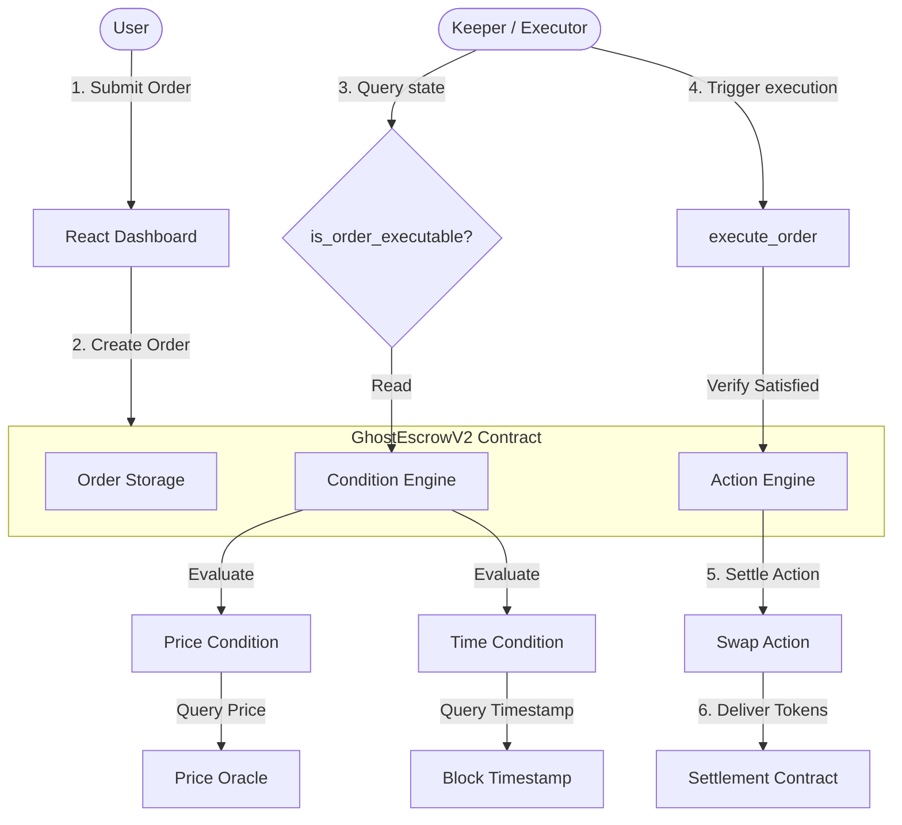

# GhostOrder

Programmable conditional execution for Starknet.

GhostOrder is an on-chain protocol that allows users to schedule conditional execution flows on Starknet. By converting user execution intents into secure, on-chain instructions, the protocol removes the need for centralized trigger infrastructure or manual transaction signing.

```
WHEN  [Price Condition]
AND   [Time Condition]
THEN  [Swap Action]
```

GhostOrder lets users create on-chain execution intents that remain dormant until their configured conditions are satisfied. Once conditions are satisfied, any permissionless keeper can trigger execution.

---

## ❓ Why GhostOrder?

Users often need to wait for a specific condition before taking an on-chain action.

For example:
> *"I want to swap STRK for USDC when STRK reaches $2.00, but I don't want to continuously monitor the market and manually execute the transaction."*

Traditional decentralised workflows force users to repeatedly check oracle feeds and manually sign transactions when conditions are met. Centralised trigger solutions introduce trust assumptions, potential single points of failure, and custody risks. GhostOrder solves this by locking assets in a secure escrow smart contract that evaluates execution parameters directly on-chain, enabling trustless trigger automation.

---

## 🔄 V1 vs V2 Evolution

GhostOrder V2 moves from a hardcoded limit-order model to a modular, programmable execution engine.

| Feature | V1 | V2 |
| :--- | :--- | :--- |
| **Execution model** | Flat conditional order | Programmable execution |
| **Conditions** | Hardcoded price check | Stored Condition objects |
| **Multiple conditions** | Limited (Price only) | Multiple conditions with AND |
| **Time conditions** | No | Yes |
| **Action model** | Fixed token swap flow | Action abstraction |
| **Keeper** | Permissionless | Permissionless |

---

## 🏗️ System Architecture

GhostOrder separates state verification logic (Conditions) from transaction settlement execution (Actions).



---

## 📋 How It Works

The lifecycle of a programmable conditional execution order consists of four steps:

### 01 — Create Order
The user specifies:
- **Conditions**: Array of state checks (e.g. STRK price $\ge$ 2.00 and Time $\ge$ X).
- **Action**: Target action parameters (e.g. Swap 10 STRK for USDC).
- **Expiry**: Absolute timestamp after which the order becomes invalid.

### 02 — Funds Enter Escrow
Input tokens (`amount_in` of `token_in`) are transferred into `GhostEscrowV2` and locked securely.

### 03 — Conditions Are Evaluated
The contract evaluates the dynamic conditions array on-chain. If any condition returns `false`, evaluation short-circuits.

### 04 — Permissionless Execution
When all conditions are satisfied, any public keeper can trigger `execute_order()`. The contract atomically transfers the input assets to the settlement contract, executes the action, and delivers the outputs directly to the owner.

---

## 🛡️ Security & Execution Guarantees

- **Immunized Execution Calldata:** Keepers only supply the `order_id` in the call. No execution parameters (tokens, amounts, or destinations) are passed by the caller, preventing parameter manipulation.
- **On-Chain Enforcement:** The evaluation logic runs completely in the Cairo VM, ensuring execution cannot bypass the condition engine.
- **Double-Execution Protection:** The order status transitions to `Executed` before any external assets leave the contract, protecting against re-entrancy and double execution.
- **Owner-Only Cancellation:** Escrowed assets can only be withdrawn via keeper execution (conditions met) or via owner cancellation.
- **Explicit Expiry Checks:** The contract rejects execution calls if `block_timestamp >= expiry`.

---

## 📍 Live on Starknet Sepolia

The V2 protocol is actively deployed and verified on **Starknet Sepolia**:

| Contract Name | Contract Address | Class Hash |
| :--- | :--- | :--- |
| **GhostEscrowV2** | `0x6a6cc27975f4020f8151ae8d6c9f8e233b879d167768f53e48a2a6be4610aa7` | `0x68746de6148b1911f18f4d6c76a73b857c5dead403efd6bdf8b10f883aef29f` |
| **MockPriceOracle** | `0x63cc916c44b0ca8e6394adbead8a30aa3c1c3de6355f1d060e2962eed5883f2` | `0x00f72365bf8ff3cc5cc919b48c105bfad2e08da2ce279148d428bf0e606060c` |
| **MockSettlement** | `0x6a24514c06e79b6879321b2d178f5d58848dc31e5c9aac5a0c51fd6bb6bf87e` | `0x040523a5bfd89ab5ffcc268df10ac35bbcd238d21b790d56b4618da2c8b0e8c8` |

### On-Chain Proof

A live integration test run has successfully verified the entire execution pipeline on Starknet Sepolia:

- **Declaration Transaction:** [0x71c696ca04db71b07796ff41cf9b2a2e6116a50c195675a9daf16a895ef836a](https://sepolia.starkscan.co/tx/0x71c696ca04db71b07796ff41cf9b2a2e6116a50c195675a9daf16a895ef836a)
- **Deployment Transaction:** [0x3be0c9c265b9e57a06bbb4d1be83ec78f5aa600849489da8cf30b734673aabe](https://sepolia.starkscan.co/tx/0x3be0c9c265b9e57a06bbb4d1be83ec78f5aa600849489da8cf30b734673aabe)
- **Create Order Transaction:** [0x71b1c7ca82957a8d26282ceb406340210a72ec8287994258b00fe2a76dd9c1f](https://sepolia.starkscan.co/tx/0x71b1c7ca82957a8d26282ceb406340210a72ec8287994258b00fe2a76dd9c1f)
- **Oracle Price Update Transaction:** [0x45694cdcbc8673a05418a7e577571e8878f1d0a1aa1167427e2419954b103b4](https://sepolia.starkscan.co/tx/0x45694cdcbc8673a05418a7e577571e8878f1d0a1aa1167427e2419954b103b4)
- **Keeper Execution Transaction:** [0xb5116c5cdb56f530d23874815a6c6351519c187c53098bf4148ea7a7ea5815](https://sepolia.starkscan.co/tx/0xb5116c5cdb56f530d23874815a6c6351519c187c53098bf4148ea7a7ea5815)

---

## 📂 Project Structure

- **[`src/ghost_escrow_v2.cairo`](file:///Users/mikasa05/Documents/Ghost/src/ghost_escrow_v2.cairo)**: Main V2 escrow contract, condition engine, and action engine.
- **[`src/types.cairo`](file:///Users/mikasa05/Documents/Ghost/src/types.cairo)**: Declarations of Cairo V2 structs, interfaces, and serialization rules.
- **[`scripts/executor.ts`](file:///Users/mikasa05/Documents/Ghost/scripts/executor.ts)**: Polling keeper script checking order execution status on-chain.
- **[`scripts/test-v2-onchain.ts`](file:///Users/mikasa05/Documents/Ghost/scripts/test-v2-onchain.ts)**: Integration script testing V2 orders dynamically.
- **[`scripts/deploy-v2.ts`](file:///Users/mikasa05/Documents/Ghost/scripts/deploy-v2.ts)**: Deployment script declaring and instantiating V2 contracts.
- **[`frontend/src`](file:///Users/mikasa05/Documents/Ghost/frontend/src)**: React wallet integration and order scheduling panel.

---

## 🚀 Quick Start

### 1. Build and Test Cairo Contracts
```bash
# Compile contracts to target/dev
scarb build

# Run contract unit tests
scarb test
```

### 2. Run the Frontend Dashboard
```bash
cd frontend
npm install
npm run dev
```

### 3. Run the On-Chain Keeper Execution Script
```bash
# Polling daemon keeper
npx ts-node scripts/executor.ts
```

### 4. Run the V2 On-Chain Integration Test
```bash
# Executes the full V2 conditional lifecycle live on Sepolia
npm run test:v2-onchain
```

---

## ✅ Current V2 Status

| Feature | Status |
| :--- | :--- |
| **GhostEscrowV2** | ✅ |
| **Price Condition** | ✅ |
| **Time Condition** | ✅ |
| **AND Conditions** | ✅ |
| **OR Conditions** | ❌ |
| **Swap Action** | ✅ |
| **Permissionless Keeper** | ✅ |
| **Cancellation** | ✅ |
| **Expiry** | ✅ |
| **Double Execution Protection** | ✅ |
| **Starknet Sepolia Deployment** | ✅ |
| **On-chain Integration Test** | ✅ |

---

## 🚧 Current Limitations

- **No Logical OR Support:** The Condition Engine only evaluates lists of conditions using logical `AND`. Compound expressions requiring logical `OR` are currently not supported.
- **Single Swap Action:** The Action Engine is structured dynamically but currently only defines the `Swap` variant. Other actions like `Transfer` or `Lend` are not yet implemented.
- **Shared Escrow Custody:** Funds must be deposited directly into the shared `GhostEscrowV2` contract escrow custody, requiring trust in the contract's locking logic.
- **Simulation Settlement:** The swap action is currently cleared through the simulated settlement interface (`MockSettlement`) rather than a live AMM aggregator.

---

## 🗺️ Future Roadmap

- **AND/OR Expression Trees:** Support nested conditional logic trees in the Cairo core.
- **Sub-Account Custody:** Implement session-key based execution intents, keeping assets in user smart-contract accounts rather than contract escrow.
- **Generic Action Variants:** Add `Transfer` (recurring payments) and `Lend` (liquidity providing) actions.
- **DEX Integrations:** Integrate AVNU and Ekubo routing for real AMM settlements on Starknet Mainnet.
