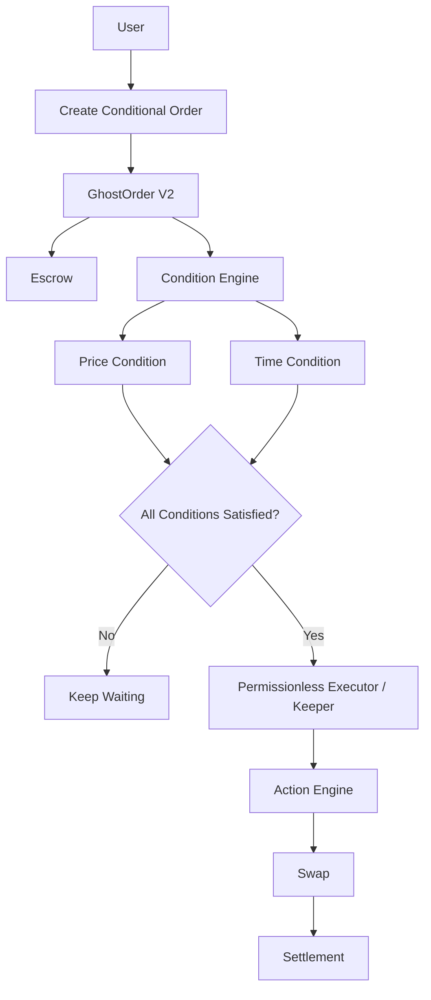

# GhostOrder

Programmable conditional execution for Starknet.

---

## ⚡ Core Primitive

```
WHEN  [Price Condition]
AND   [Time Condition]
THEN  [Swap Action]
```

GhostOrder is an on-chain protocol that allows users to schedule conditional executions on Starknet. Rather than relying on centralized bots or manual monitoring, GhostOrder converts intent logic into a secure, programmable, on-chain instruction.

---

## ⚠️ The Problem

Users often need to wait for specific conditions to be met before executing on-chain transactions.

For example:
> *"I want to swap my STRK for USDC when the STRK price reaches $2.00, but I don't want to constantly monitor the market or keep a browser tab open."*

Traditional decentralised applications force the user to repeatedly check oracle feeds and manually sign execution transactions when the targets are hit. This is inefficient, introduces execution latency, and degrades user experience.

---

## 💡 The Solution

GhostOrder solves this by decoupling **Conditions** (on-chain state checks) from **Actions** (execution settlements):

- **WHEN:** The price of STRK is equal to or greater than $2.00.
- **AND:** The current block timestamp is past a specific execution delay.
- **THEN:** Execute the configured swap action through the settlement interface.

The user deposits inputs into a secure escrow contract and registers the conditional logic. The contract evaluates these conditions directly on-chain. When they are satisfied, any public keeper or searcher can permissionlessly trigger the execution of the order.

---

## 🔄 V1 vs V2 Comparison

- **V1 (Conditional Trading):** A flat limit order system. Price checking logic (`oracle.get_price() >= target_price`) and token mappings are hardcoded directly into the main execution route.
- **V2 (Programmable Execution):** A modular intent execution engine. Orders store an array of generic `Condition` and `Action` structures. The contract processes condition lists using short-circuiting logical `AND` operators on-chain.

---

## 🏗️ How It Works

The following flowchart illustrates the lifecycle of a V2 conditional execution order:



---

## 📂 System Architecture

### 1. Cairo Smart Contracts (`/src`)
- **`ghost_escrow_v2.cairo`**: The core execution contract. Holds locked assets, evaluates logic arrays using short-circuiting logical `AND` evaluation, and handles the action engine.
- **`types.cairo`**: Declares structs for `Condition`, `Action`, `OrderV2` and associated comparator and type enums.
- **Mock Infrastructure**:
  - `mock_price_oracle.cairo`: Simulation oracle representing asset pair prices.
  - `mock_settlement.cairo`: Receives the input tokens from escrow and delivers output tokens to the user.
  - `mock_erc20.cairo`: Used for testing token pairs.

### 2. Keeper Executor (`/scripts`)
- **`executor.ts`**: Connects to the Starknet network, scans active orders, calls the `is_order_executable` view method, and triggers execution transactions for satisfied orders.

### 3. Frontend Dashboard (`/frontend`)
- **Web Interface**: Built with React and Tailwind CSS. Features an interactive form for inputting "WHEN/AND/THEN" logic, along with real-time tracking of order states.

---

## 🛡️ Security & Integrity Guarantees

- **No Malicious Calldata Execution**: Keepers do not supply execution inputs (such as tokens, target prices, or recipient addresses). All execution parameters are read directly from on-chain storage populated at creation.
- **Re-entrancy & Double-Execution Protection**: Order status transitions instantly from `Active` to `Executed` or `Cancelled` in storage before funds are cleared, preventing double execution.
- **Owner-Only Cancellations**: Escrowed tokens can only be unlocked by execution (when targets are met) or by cancellation (initiated strictly by the order owner).

---

## 📍 Deployed Contracts (Starknet Sepolia)

The V2 protocol is actively deployed on **Starknet Sepolia**:

| Contract Name | Contract Address / Class Hash |
| :--- | :--- |
| **GhostEscrowV2** | Address: `0x6a6cc27975f4020f8151ae8d6c9f8e233b879d167768f53e48a2a6be4610aa7`<br>Class Hash: `0x68746de6148b1911f18f4d6c76a73b857c5dead403efd6bdf8b10f883aef29f` |
| **MockPriceOracle** | Address: `0x63cc916c44b0ca8e6394adbead8a30aa3c1c3de6355f1d060e2962eed5883f2` |
| **MockSettlement** | Address: `0x6a24514c06e79b6879321b2d178f5d58848dc31e5c9aac5a0c51fd6bb6bf87e` |

---

## 📝 On-Chain Verification & Transactions

A live end-to-end integration test was executed successfully against our V2 deployment on Sepolia:

- **V2 Declaration Transaction:** `0x71c696ca04db71b07796ff41cf9b2a2e6116a50c195675a9daf16a895ef836a`
- **V2 Deployment Transaction:** `0x3be0c9c265b9e57a06bbb4d1be83ec78f5aa600849489da8cf30b734673aabe`
- **Create Order Transaction (STRK Approval + Order Created):** [0x71b1c7ca82957a8d26282ceb406340210a72ec8287994258b00fe2a76dd9c1f](https://sepolia.starkscan.co/tx/0x71b1c7ca82957a8d26282ceb406340210a72ec8287994258b00fe2a76dd9c1f)
- **Oracle Price Update Transaction (Price set to $2.50):** [0x45694cdcbc8673a05418a7e577571e8878f1d0a1aa1167427e2419954b103b4](https://sepolia.starkscan.co/tx/0x45694cdcbc8673a05418a7e577571e8878f1d0a1aa1167427e2419954b103b4)
- **Keeper Execution Transaction:** [0xb5116c5cdb56f530d23874815a6c6351519c187c53098bf4148ea7a7ea5815](https://sepolia.starkscan.co/tx/0xb5116c5cdb56f530d23874815a6c6351519c187c53098bf4148ea7a7ea5815)

---

## 🚀 Getting Started

### Prerequisites
- Scarb (Cairo 2.x compiler)
- Node.js (v18+)

### 1. Build and Test Cairo Contracts
```bash
# Compile Sierra/Casm artifacts
scarb build

# Run unit tests (V1 & V2)
scarb test
```

### 2. Run the Frontend Dashboard
```bash
cd frontend
npm install
npm run dev
```

### 3. Run the On-Chain Keeper Execution Script
```bash
# Polling daemon keeper
npx ts-node scripts/executor.ts
```

### 4. Run the V2 On-Chain Integration Test
```bash
# Executes the full V2 conditional lifecycle live on Sepolia
npm run test:v2-onchain
```

---

## 🚫 Protocol Limitations

- **No Logical OR Support:** The Condition Engine only evaluates lists of conditions using logical `AND`. Compound expressions requiring logical `OR` are currently not supported.
- **Single Swap Action:** The Action Engine is structured dynamically but currently only defines the `Swap` variant. Other actions like `Transfer` or `Lend` are not yet implemented.
- **Shared Escrow Custody:** Funds must be deposited directly into the shared `GhostEscrowV2` contract escrow custody, requiring trust in the contract's locking logic.

---

## 🗺️ V3 / Future Roadmap

- **Logical OR Expression Trees:** Expand the Cairo Condition Engine to support arbitrary nested logical trees of `AND` and `OR` operators.
- **Sub-Account Wallets:** Pivot from a shared escrow deposit pool to user-deployed smart contract wallets or session key authorization, preserving custody of assets in user-owned accounts.
- **Generic Action Variants:** Add `Transfer` (recurring deposits/transfers) and `Lend` (liquidity provision/yield optimization) action handlers.
- **Production Settlement Integrations:** Integrate with live Starknet AMMs and aggregators (AVNU, Ekubo, Fibrous) for production swap settlements.
